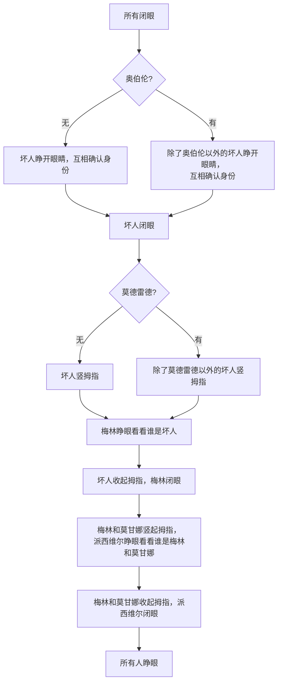

<!-- https://img-1257141638.cos.ap-beijing.myqcloud.com/a16b54c2-aca6-4d6c-ad4f-8cd0bc1b5d7c -->

## 什么是快捷指令（Shortcuts）

> 快捷指令是一种可让你使用 App 完成一个或多个任务的快捷方式。“快捷指令” App 可让你创建包含多个步骤的快捷指令。例如，你可以构建一个“冲浪时间”快捷指令来获取冲浪报道、提供预计到达海滩的时间以及播放冲浪音乐播放列表。

{: w="200" }
_快捷指令 App_

## 有什么功能

快捷指令提供了非常丰富的能力，比如媒体类的`裁剪图片`、`拼接图片`；文稿类的`翻译文本`、`制作PDF`；以及网页类的`获取网页内容`等等。当然还有如果第三方App 提供了支持，也可以在快捷指令里面执行第三方App的能力。比如笔记类的 App 通常会提供添加笔记能力。

## 我能做什么

有了这些丰富的基础能力，我们可以做的事情就变的非常多了。下面设想了3个场景，也是我平时会常用到的快捷指令。

### 拼接长截图

当然目前有很多付费软件都支持拼接长截图，或者通过录屏来直接生成长截图。这里不去讨论各种截图软件的优劣，只是从最简单的场景来介绍快捷指令的能力。

这里主要是用了快捷指令 App 中的 `媒体`->`拼接图像`。主要流程：自己将想要拼接的界面分别截图，然后裁剪首尾，最后调用拼接截图的快捷指令完成拼图。

由于步骤比较简单，这里就不详细说明了。

### 阿瓦隆游戏

游戏介绍可参考 <a href="https://www.douban.com/note/523559795" target="_blank">桌游干货《阿瓦隆》游戏规则及速成攻略</a>

由于游戏开始时，有一系列认身份的环节，此时需要一个人来主持。比较诡异的是如果专门让一个人来主持就有点浪费，因为后续的游戏过程是不需要这样的人存在，所以只有让在场的玩家闭着眼来主持。这样当然也没问题，不过既然是人来主持难免会遇到顺序以及流程上出错的问题，于是就考虑到用快捷指令来完成这个任务。

#### 流程

1. 坏人互认身份
2. 梅林得知坏人身份
3. 派西维尔得知梅林和莫甘娜身份

话术大致如下：

`“所有闭眼”`

`“坏人睁开眼睛，互相确认身份”`

`“坏人闭眼”`

`“坏人竖拇指，梅林睁眼看看谁是坏人”`

`“坏人收起拇指，梅林闭眼”`

`“梅林和莫甘娜竖起拇指，派西维尔睁眼看看谁是梅林和莫甘娜”`

`“梅林和莫甘娜收起拇指，派西维尔闭眼”`

`“所有人睁眼”`

需要注意的是坏人里面还有2个角色，如果在游戏中会让话术有点不一样。

**奥伯伦**

> 不知道谁是坏人，坏人也不知道他。梅林知道他是坏人

**莫德雷德**

> 梅林不知道他是坏人

当角色里面有`奥伯伦`时，以下话术会有点不一样

`“坏人睁开眼睛，互相确认身份”  ->  “除了奥伯伦以外的坏人睁开眼睛，互相确认身份”`

当角色里面有`莫德雷德`时，以下话术会有点不一样

`“坏人竖拇指，梅林睁眼看看谁是坏人”  ->  “除了莫德雷德以外的坏人竖拇指，梅林睁眼看看谁是坏人”`

人数及任务配置：

* 5人：梅林、派西维尔、忠臣*1  vs 莫甘娜、刺客
* 6人：梅林、派西维尔、忠臣*2  vs 莫甘娜、刺客
* 7人：梅林、派西维尔、忠臣*2  vs 莫甘娜、奥伯伦、刺客
* 8人：梅林、派西维尔、忠臣*3  vs 莫甘娜、刺客、爪牙
* 9人：梅林、派西维尔、忠臣*4  vs 莫德雷德、莫甘娜、刺客
* 10人：梅林、派西维尔、忠臣*4  vs 莫德雷德、莫甘娜、奥伯伦、刺客

当我们明确了所有流程后，我们就可以来制作快捷指令来完成我们想要的效果了。

#### 制作

根据上面的规则，我们可以列出流程图方便我们后面的制作。

1.**确定角色**

我们知道有 `奥伯伦` 和 `莫德雷德` 角色存在时，我们的话术会有点不一样，所以我们在制作快捷指令时就可以针对如下情况进行调整：

{: w="200" .right}

- 没有奥伯伦和莫德雷德 （5、6、8 人局）
- 只有奥伯伦 （7人局）
- 只有莫德雷德 （9人局）
- 同时有奥伯伦和莫德雷德 （10人局）

于是我们在快捷指令最开始就可以配置一个可以进行任务选择列表与选择框，选项即为我们上面总结好的文案。

2.**朗读文案**

{: w="200" .right}

我们需要让快捷指令帮助我们来主持，所以需要将文案朗读出来，这里可以使用快捷指令的`朗读`功能，可以朗读定义的文案。另外提示下，有时候我们手机音量是被设置很小的，想要大家听见可能需要调大音量，当然你可以手动调整，这里推荐直接用快捷指令里面设置手机音量的功能顺便完成对手机音量的控制。

3.**选择文案**

{: w="120" .right}
{: w="120" .right}

然后我们使用快捷指令里面`脚本`->`如果`功能，来针对我们之前选择过的角色来进行判断。这里我们直接针对文案本身来进行匹配判断，如果文案里面有`奥伯伦`、`莫德雷德`，我们就选择对应的文案进行朗读。从而达到我们想要的，针对存在的不同角色，有着对应不同文案的区分，也方便不是很熟悉规则的人明白现在要干什么。避免造成不该睁眼的时候睁眼，不该竖拇指的时候竖拇指。

4.**随机选择队长**

{: w="200" .right}

当认身份环节结束后，我们还需要随机选择一名队长来开始组队，然后开始后么的游戏。可以使用`脚本`->`随机数`来完成我们的想法。因为一开始我们不是针对人数来判断角色，而是以是否存在某些角色来做判断，所以这里为了方便就没有针对游戏人数来配置随机数，而是以时钟方向来随机分配。

#### 成品

最后完整的快捷指令如下：

未完待续...