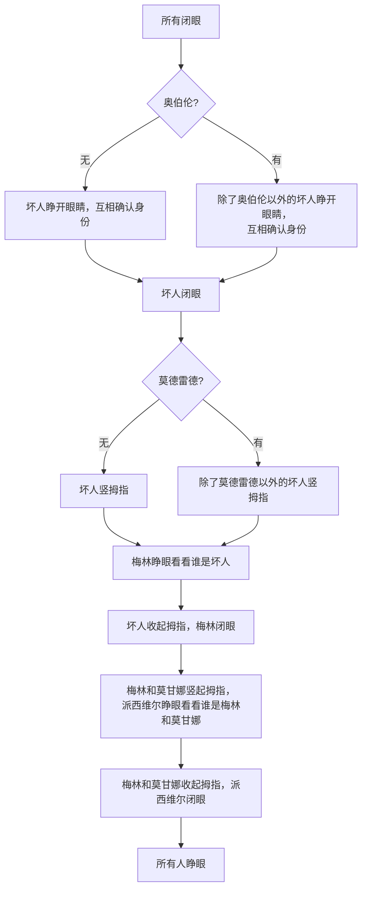

## 什么是快捷指令（Shortcuts）

> 快捷指令是一种可让你使用 App 完成一个或多个任务的快捷方式。“快捷指令” App 可让你创建包含多个步骤的快捷指令。例如，你可以构建一个“冲浪时间”快捷指令来获取冲浪报道、提供预计到达海滩的时间以及播放冲浪音乐播放列表。

{: w="200" }
_快捷指令 App_

## 有什么功能

快捷指令提供了非常丰富的能力，比如媒体类的`裁剪图片`、`拼接图片`；文稿类的`翻译文本`、`制作PDF`；以及网页类的`获取网页内容`等等。当然还有如果第三方App 提供了支持，也可以在快捷指令里面执行第三方App的能力。比如笔记类的 App 通常会提供添加笔记能力。

## 我能做什么

有了这些丰富的基础能力，我们可以做的事情就变的非常多了。下面设想了3个场景，也是我平时会常用到的快捷指令。

### 拼接长截图

当然目前有很多付费软件都支持拼接长截图，或者通过录屏来直接生成长截图。这里不去讨论各种截图软件的优劣，只是从最简单的场景来介绍快捷指令的能力。

这里主要是用了快捷指令 App 中的 `媒体`->`拼接图像`。主要流程：自己将想要拼接的界面分别截图，然后裁剪首尾，最后调用拼接截图的快捷指令完成拼图。

由于步骤比较简单，这里就不详细说明了。

[](https://www.icloud.com/shortcuts/d10afc1f15f64ca9bf1c14d531f2833f)

### 阿瓦隆游戏

游戏介绍可参考 <a href="https://www.douban.com/note/523559795" target="_blank">桌游干货《阿瓦隆》游戏规则及速成攻略</a>

由于游戏开始时，有一系列认身份的环节，此时需要一个人来主持。比较诡异的是如果专门让一个人来主持就有点浪费，因为后续的游戏过程是不需要这样的人存在，所以只有让在场的玩家闭着眼来主持。这样当然也没问题，不过既然是人来主持难免会遇到顺序以及流程上出错的问题，于是就考虑到用快捷指令来完成这个任务。

#### 流程

1. 坏人互认身份
2. 梅林得知坏人身份
3. 派西维尔得知梅林和莫甘娜身份

话术大致如下：

`“所有闭眼”`

`“坏人睁开眼睛，互相确认身份”`

`“坏人闭眼”`

`“坏人竖拇指，梅林睁眼看看谁是坏人”`

`“坏人收起拇指，梅林闭眼”`

`“梅林和莫甘娜竖起拇指，派西维尔睁眼看看谁是梅林和莫甘娜”`

`“梅林和莫甘娜收起拇指，派西维尔闭眼”`

`“所有人睁眼”`

需要注意的是坏人里面还有2个角色，如果在游戏中会让话术有点不一样。

**奥伯伦**

> 不知道谁是坏人，坏人也不知道他。梅林知道他是坏人

**莫德雷德**

> 梅林不知道他是坏人

当角色里面有`奥伯伦`时，以下话术会有点不一样

`“坏人睁开眼睛，互相确认身份”  ->  “除了奥伯伦以外的坏人睁开眼睛，互相确认身份”`

当角色里面有`莫德雷德`时，以下话术会有点不一样

`“坏人竖拇指，梅林睁眼看看谁是坏人”  ->  “除了莫德雷德以外的坏人竖拇指，梅林睁眼看看谁是坏人”`

人数及任务配置：

* 5人：梅林、派西维尔、忠臣*1  vs 莫甘娜、刺客
* 6人：梅林、派西维尔、忠臣*2  vs 莫甘娜、刺客
* 7人：梅林、派西维尔、忠臣*2  vs 莫甘娜、奥伯伦、刺客
* 8人：梅林、派西维尔、忠臣*3  vs 莫甘娜、刺客、爪牙
* 9人：梅林、派西维尔、忠臣*4  vs 莫德雷德、莫甘娜、刺客
* 10人：梅林、派西维尔、忠臣*4  vs 莫德雷德、莫甘娜、奥伯伦、刺客

当我们明确了所有流程后，我们就可以来制作快捷指令来完成我们想要的效果了。

#### 制作

根据上面的规则，我们可以列出流程图方便我们后面的制作。



1.**确定角色**

我们知道有 `奥伯伦` 和 `莫德雷德` 角色存在时，我们的话术会有点不一样，所以我们在制作快捷指令时就可以针对如下情况进行调整：

{: w="200" .right}

- 没有奥伯伦和莫德雷德 （5、6、8 人局）
- 只有奥伯伦 （7人局）
- 只有莫德雷德 （9人局）
- 同时有奥伯伦和莫德雷德 （10人局）

于是我们在快捷指令最开始就可以配置一个可以进行任务选择列表与选择框，选项即为我们上面总结好的文案。

2.**朗读文案**

{: w="200" .right}

我们需要让快捷指令帮助我们来主持，所以需要将文案朗读出来，这里可以使用快捷指令的`朗读`功能，可以朗读定义的文案。另外提示下，有时候我们手机音量是被设置很小的，想要大家听见可能需要调大音量，当然你可以手动调整，这里推荐直接用快捷指令里面设置手机音量的功能顺便完成对手机音量的控制。

3.**选择文案**

{: w="120" .right}
{: w="120" .right}

然后我们使用快捷指令里面`脚本`->`如果`功能，来针对我们之前选择过的角色来进行判断。这里我们直接针对文案本身来进行匹配判断，如果文案里面有`奥伯伦`、`莫德雷德`，我们就选择对应的文案进行朗读。从而达到我们想要的，针对存在的不同角色，有着对应不同文案的区分，也方便不是很熟悉规则的人明白现在要干什么。避免造成不该睁眼的时候睁眼，不该竖拇指的时候竖拇指。

4.**随机选择队长**

{: w="200" .right}

当认身份环节结束后，我们还需要随机选择一名队长来开始组队，然后开始后么的游戏。可以使用`脚本`->`随机数`来完成我们的想法。因为一开始我们不是针对人数来判断角色，而是以是否存在某些角色来做判断，所以这里为了方便就没有针对游戏人数来配置随机数，而是以时钟方向来随机分配。

#### 成品

最后完整的快捷指令如下：

[](https://www.icloud.com/shortcuts/0841980344fd44cdbb40bbf004d5abd9)


### 碎碎念自动发布

本博客的“碎碎念” Tab 下的内容就是通过快捷指令直接发布，然后按发布时间插入内容。基于本博客采用的是 [Jekyll](https://jekyllrb.com/)，发布是通过 Github 完成的，所以想要发布一篇文章或者说一句话，就等同于更新 Github 上的一个文件即可，不过还是有些细节需要处理。

#### 前提

先明确我们具体需要做什么。

**1.文件按天分割**

在“碎碎念” Tab 下，是针对 `_talk` 目录下的文件进行输出显示，每个文件表示当天所发布的文字，命名规则为当天的日期以`yyyy-MM-dd.md` 的形式命名，如：`2024-10-10.md`。如果发布当天还没有以此命名的文件则创建一个以当天日期命名的新文件，并把内容写入。

**2.单个文件支持文字追加**

每天可能会发多次文字，所以单个文件需要支持追加文案。

**3.细节处理**

- 针对每个文件需要添加 `Front Matter` 配置，以此来支持显示日期、天气、气温以及地理位置等信息。
- 单个文件中，每一次添加的文字前面加上当前时间以及对应 emoji。

**4.Github 交互**

Github 有支持获取/更新文件 api。
- [Get repository content](https://docs.github.com/en/free-pro-team@latest/rest/repos/contents?apiVersion=2022-11-28#get-repository-content) 

_获取文件方式_
- [Create or update file contents](https://docs.github.com/en/free-pro-team@latest/rest/repos/contents?apiVersion=2022-11-28#create-or-update-file-contents)

_添加文件方式_

_更新文件方式_

根据官方提供的 api，我们可以总结以下特点：

- 任何文件操作都需要 `TOKEN` 这里我们使用的是 [Personal access tokens](https://docs.github.com/en/authentication/keeping-your-account-and-data-secure/managing-your-personal-access-tokens)，可以在 <https://github.com/settings/tokens> 这里创建。
- 更新文件时，需要 `sha` 参数，`sha` 值我们可以在获取文件时得到。
> **`sha`** string
>
> **Required if you are updating a file**. The blob SHA of the file being replaced.
- 获取文件时，我们得到的数据结构如下：（只列举我们需要的内容）
```json
{
    "content": "IyBZb2dhIEJvmsgaW4gcHJvZ3Jlc3MhIEZlZWwg....",
    "sha": "3d21ec53a331a6f037a91c368710b99387d012c1"
}
```
- 获取文件的数据后，`content` 字段是经过了 `Base64` 加密后的字符串，我们在处理时需要对其进行解密。

#### 设计

{: w="200" .shadow}
_碎碎念发布快捷指令_

如上图所示，将发布步骤稍微分割了下，避免在一个快捷指令里面做过多的事情，方便后续修改维护。

具体步骤如下：

1. 入口：获取将要发布的新文字(I'm thinking)
2. 获取文件(Get File)
    1. 生成以当天日期命名的文件名(File Name)
    2. 生成该文件在`Github`中对应的地址`URL`(Github File Name)
    3. 获取 `TOKEN`（Github Token） 
    4. 通过 HTTP 请求获取文件信息
3. 创建文件对象(File Content Object)
    1. 针对返回数据，判断是否需要创建新的文件
    2. 文件不存在
        1. 生成文件头(Tile Text)
            ```markdown
            ---
            title: 2023-10-10
            date: 2023-10-10T09:41:00+08:00
            weather: ☁️
            temperature: 8°C ～ 23°C
            location: 北京市
            ---
            ```
        2. 创建对象
            ```javascript
            {
                "content": "xxxxxx"
            }
            ```
    3. 文件已存在
        1. 解密 `content` 内容
        2. 创建对象
        ```javascript
            {
                "content": "xxxxxxx",
                "sha": "xxxxxxx"
            }
        ```
4. 将入口获取的文字追加到文件对象中
    ```javascript
    {
        "newContent": "xxxxxxx",
        "content": "xxxxxxx",
        "sha": "xxxxxxx" /// 如果是新增文件，则没有该字段
    }
    ```
5. 更新文件对象(Update File Content Object)
    1. 生成当前时间(Time Format)
    2. 读取文件对象中的当前文件内容和新文字
    3. 将时间和新文字换行追加到当前文件内容中
6. 更新 Github 文件(Update File To Github)
    1. 对 `content` 使用 `Base64` 加密
    2. 上传至 Github

#### 实现


## 最后

上面大致体现了快捷指令一些能力，我们可以发挥自己的想象力去将一些琐碎、低效、高率的事情用快捷指令来帮助完成。

更多例子：

1. 把 [tinypng](https://tinypng.com/) 的服务利用快捷指令变成系统服务。 [](https://www.icloud.com/shortcuts/991d151c1a164f039e8013e9a49c611a)
2. 在背单词的时候，通过快捷指令自动查询单词切生成我需要的格式。
    ```markdown
    summarize -> **summarize** /ˈsʌm.ə.raɪz/ *verb.* 总结
    ```